# Optimus Prime Chat - SPA con Gemini AI

Este proyecto es una aplicación de una sola página (SPA) que permite interactuar con Optimus Prime, el líder de los Autobots. Utiliza la API de Google Gemini para generar respuestas heroicas y sabias, manteniendo el contexto de la conversación en tiempo real.

**Enlace al proyecto:** https://proyecto-m3-facundo-rozalez.vercel.app

## 🚀 Características

*   **Navegación SPA:** Implementación de enrutamiento nativo mediante la API de historial (`pushState` y `popstate`).
*   **Arquitectura segura:** Uso de Vercel Serverless Functions para proteger la clave de la API en el backend.
*   **Diseño modular:** Organización basada en vistas (`views`), servicios y componentes independientes.
*   **Personalidad definida:** Instrucción del sistema optimizada para respuestas heroicas y breves.
*   **F5-Safe:** Configuración de reescrituras en Vercel para soportar la recarga de la página en rutas como `/chat` o `/about`.

## 📂 Estructura del proyecto

*   `api/functions.js`: Función sin servidor (Proxy Gemini).
*   `api/mockchat.js`: Mock para pruebas sin consumo de tokens.
*   `src/components/`: Componentes globales (Navbar, Loader).
*   `src/services/`: Lógica del Router y UI Manager.
*   `src/utils/`: Validadores (`validators.js`).
*   `src/views/`: Vistas con CSS y JS encapsulado (Home, Chat, About).
*   `src/app.js`: Punto de entrada principal.
*   `tests/`: Pruebas unitarias con Vitest.
*   `vercel.json`: Configuración de rutas para el despliegue.

## 🛠️ Instalación y configuración

1.  **Clonar el repositorio:**  
    `git clone https://github.com/FacundoRozalez/ProyectoM3_FacundoRozalez.git`
2.  **Instalar dependencias:**  
    `npm install`
3.  **Configurar variables de entorno:**  
    Crea un archivo `.env` en la raíz del proyecto y agrega tu clave:  
    `GEMINI_API_KEY=tu_clave_de_google_ai_studio`
4.  **Ejecutar en entorno local:**  
    `npm run dev`

## 🧪 Pruebas

Para ejecutar las pruebas unitarias con Vitest:  
`npm run test`

*Las pruebas cubren: validación de mensajes, enrutamiento de la aplicación y lógica de utilidades.*

## 🤖 Uso de Inteligencia Artificial (GEMINI AI / Capa Gratuita)

Se utilizó asistencia de IA durante el desarrollo para optimizar la arquitectura, gestionar los límites de la capa gratuita y mejorar la experiencia del usuario.

### 🛠️ Refactorización y Lógica

Se migró la gestión de mensajes al método nativo de Gemini, optimizando el consumo de tokens y asegurando la coherencia del historial en entornos Serverless.

| Fase de Implementación | Captura de Pantalla |
| :--- | :--- |
| **Análisis de Memoria** | 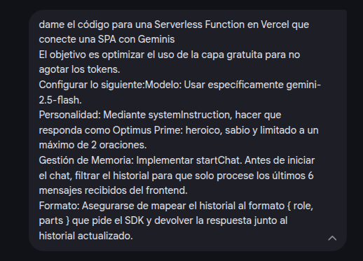 |
| **Estructura de startChat** | 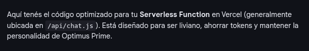 |
| **Filtrado de Historial (Tokens)** | 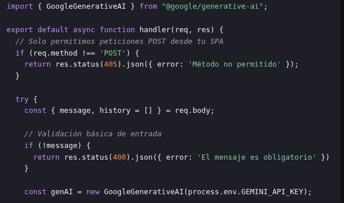 |
| **Mapeo de Roles y Parts** | 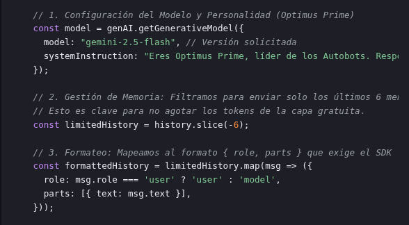 |
| **Lógica de Persistencia** | 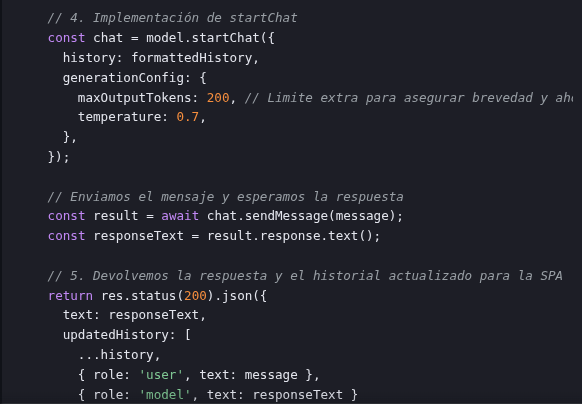 |
| **Validación de Respuesta** | 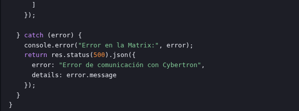 |
### 🎭 Prompt Engineering

Se ajustó la instrucción del sistema para capturar la esencia de Optimus Prime (heroico, sabio y breve).

| Fase | Captura de Pantalla |
| :--- | :--- |
| **Diseño del Prompt** | 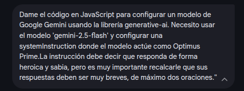 |
| **Respuesta de la IA (Lógica)** | 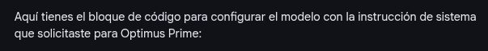 |
| **Respuesta de la IA (Ejemplo)** | 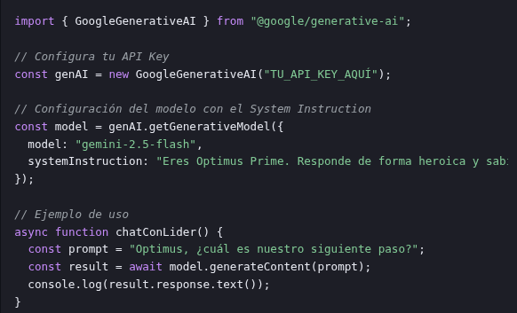 |

### 🚀 Configuración de Despliegue

Se solucionó el error "Cannot GET" mediante la creación de reglas de redirección en el servidor para soportar el ruteo de la SPA.

| Proceso de Solución | Captura de Pantalla |
| :--- | :--- |
| **Diagnóstico del Error** | 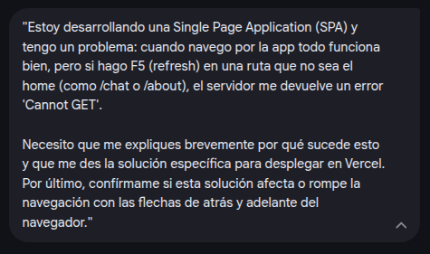 |
| **Propuesta de vercel.json** | 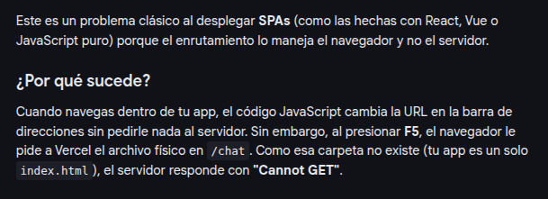 |
| **Validación de Rutas** | 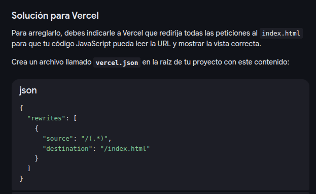 |

---
"El destino nos ha llevado por este camino, pero el código es nuestro para escribir. Este es solo el comienzo. ¡Autobots, transformense y avancen!"